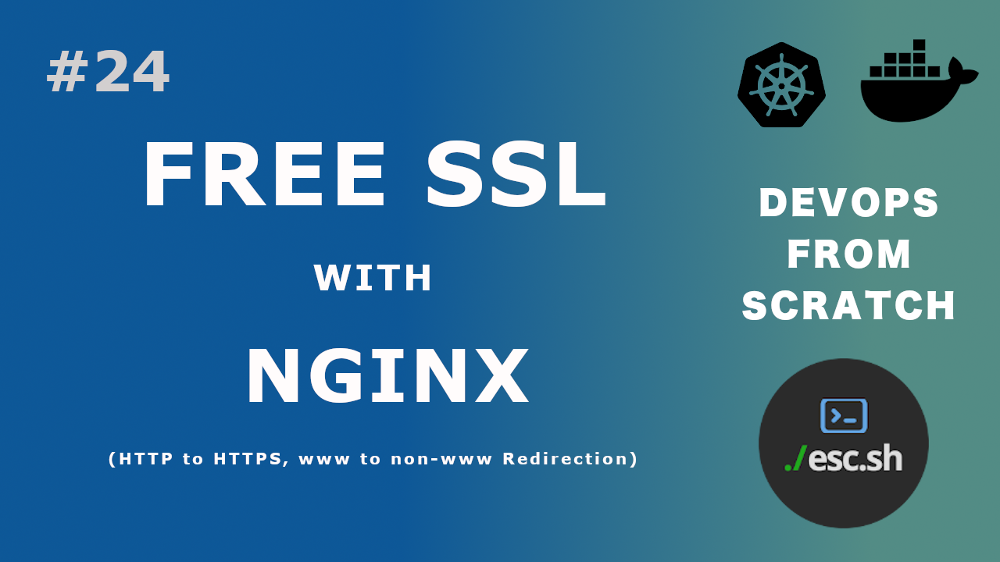

# How to configure SSL with Let's Encrypt and Nginx (Production Ready)


This document explains how to setup and configure SSL for a domain name
with Let'sEncrypt and Nginx

## Video Link
[](https://youtu.be/NRJIhc3aQn0)


For this tutorial, I will be using a Debian 10 server. This should work for any debian
based distro

## Goals

1. Fetch SSL certificates for a domain
2. Configure Nginx to use SSL
3. HTTP to HTTPS redirection : [HERE](#step-6-optional---redirect-http-to-https)
4. Auto renew certificates :    [HERE](#step-7---enable-auto-renew)
5. Redirect www to non-www or viceversa : [HERE](#step-8-optional---redirect-www-to-non-www-or-vice-versa)
    - Redirect www to non-www without http to https redirection : [HERE](#without-http---https-redirection)
    - Redirect www to non-www with http to https redirection : [HERE](#with-http---https-redirection)
    - Redirect non-www to www without http to https redirection : [HERE](#without-http---https-redirection-1)
    - Redirect non-www to www with http to https redirection : [HERE](#with-http---https-redirection-1)


## Prerequisites

- A publicly accessible server (if you plan to use HTTP challenge to fetch the certificate)
- Domain name pointed to the server's address. I will use `ssl.demo.esc.sh`. If you have a domain
  like `example.com` and you want to use `example.com` and `www.example.com`, then make sure you
  point both to the server's IP address.

  I will use `ssl.demo.esc.sh` and `www.ssl.demo.esc.sh` to avoid any confusion.

  > If you are confused with the multiple levels of subdomains, don't be, it works the same
  > way as `example.com` or `www.example.com`
- Nginx running - `sudo apt install nginx`

## Step 1 - Install certbot

Certbot - Let's us fetch SSL certificates from Let's Encrypt
python3-certbot-nginx - Helps us configure Nginx SSL config

```
sudo apt install certbot python3-certbot-nginx
```

## Step 2 (Optional) - Verify that the domains are pointing to our server IP

```
➜  ~ dig ssl.demo.esc.sh +short
139.59.42.9


➜  ~ dig www.ssl.demo.esc.sh +short
139.59.42.9
```

## Step 3 - Create letsencrypt.conf

Remember, the LetsEncrypt certificates are **valid only for 90 days**. That means, we need
to renew them regularly.

This conf is needed so that when letsencrypt tries to renew the certificate, it can access
the domain over http without being redirected. That is, without this conf, if we are 
redirecting all http to https, then even the letsencrypt renewal requests too will get
redirected, causing the renewal to fail


Create `/etc/nginx/snippets/letsencrypt.conf` with the following content

```nginx
location ^~ /.well-known/acme-challenge/ {
    default_type "text/plain";
    root /var/www/letsencrypt;
}
```

Create the directory
```
mkdir /var/www/letsencrypt

```
## Step 3 - Configure Nginx for HTTP


If you already have an HTTP configuration, all you have to do is, the `include` part


Create `/etc/nginx/sites-enabled/ssl.demo.esc.sh` (Change the domain name obviously)

```nginx
server {
    listen 80;

    include /etc/nginx/snippets/letsencrypt.conf;

    server_name ssl.demo.esc.sh www.ssl.demo.esc.sh;

    root /var/www/ssl.demo.esc.sh;
    index index.html;
}
```

Verify nginx `nginx -t`

Reload Nginx

```
sudo systemctl reload nginx
```


## Step 4 (Optional) - Configure the Firewall

If you have been following the `DevOps From Scratch`, you probably don't have a firewall
yet, so skip this. But if you do, allow port 80 to be accessed from anywhere

## Step 5 - Fetch the Certificate

```
sudo certbot --nginx -d ssl.demo.esc.sh -d www.ssl.demo.esc.sh
```

Make sure to give the proper domain names.

If everything went well, you should see something like:
(Please note that I chose not to setup a redirect from HTTP to HTTPS)

```
> certbot --nginx -d ssl.demo.esc.sh -d www.ssl.demo.esc.sh
Saving debug log to /var/log/letsencrypt/letsencrypt.log
Plugins selected: Authenticator nginx, Installer nginx
Obtaining a new certificate
Performing the following challenges:
http-01 challenge for ssl.demo.esc.sh
http-01 challenge for www.ssl.demo.esc.sh
Waiting for verification...
Cleaning up challenges
Deploying Certificate to VirtualHost /etc/nginx/sites-enabled/ssl.demo.esc.sh
Deploying Certificate to VirtualHost /etc/nginx/sites-enabled/ssl.demo.esc.sh

Please choose whether or not to redirect HTTP traffic to HTTPS, removing HTTP access.
- - - - - - - - - - - - - - - - - - - - - - - - - - - - - - - - - - - - - - - -
1: No redirect - Make no further changes to the webserver configuration.
2: Redirect - Make all requests redirect to secure HTTPS access. Choose this for
new sites, or if you're confident your site works on HTTPS. You can undo this
change by editing your web server's configuration.
- - - - - - - - - - - - - - - - - - - - - - - - - - - - - - - - - - - - - - - -
Select the appropriate number [1-2] then [enter] (press 'c' to cancel): 1

- - - - - - - - - - - - - - - - - - - - - - - - - - - - - - - - - - - - - - - -
Congratulations! You have successfully enabled https://ssl.demo.esc.sh and
https://www.ssl.demo.esc.sh

You should test your configuration at:
https://www.ssllabs.com/ssltest/analyze.html?d=ssl.demo.esc.sh
https://www.ssllabs.com/ssltest/analyze.html?d=www.ssl.demo.esc.sh
```


At this point, you should have the certificates in place. Your nginx conf will look
similar to this

```nginx
server {
    listen 80;

    include /etc/nginx/snippets/letsencrypt.conf;

    server_name ssl.demo.esc.sh www.ssl.demo.esc.sh;

    root /var/www/ssl.demo.esc.sh;
    index index.html;

    listen 443 ssl; # managed by Certbot
    ssl_certificate /etc/letsencrypt/live/ssl.demo.esc.sh/fullchain.pem; # managed by Certbot
    ssl_certificate_key /etc/letsencrypt/live/ssl.demo.esc.sh/privkey.pem; # managed by Certbot
    include /etc/letsencrypt/options-ssl-nginx.conf; # managed by Certbot
    ssl_dhparam /etc/letsencrypt/ssl-dhparams.pem; # managed by Certbot


}
```

## Step 6 (Optional) - Redirect HTTP to HTTPS

It is recommended that you enable HTTP to HTTPS redirection
Edit the nginx conf and make it look like this

```nginx
server {
    listen 80;

    include /etc/nginx/snippets/letsencrypt.conf;

    server_name ssl.demo.esc.sh www.ssl.demo.esc.sh;

    # We are redirecting all request to port 80 to the https server block
    location / {
       return 301 https://$host$request_uri;
    }
}
server {

    listen 443 ssl; # managed by Certbot

    ssl_certificate /etc/letsencrypt/live/ssl.demo.esc.sh/fullchain.pem; # managed by Certbot
    ssl_certificate_key /etc/letsencrypt/live/ssl.demo.esc.sh/privkey.pem; # managed by Certbot

    include /etc/letsencrypt/options-ssl-nginx.conf; # managed by Certbot
    ssl_dhparam /etc/letsencrypt/ssl-dhparams.pem; # managed by Certbot

    server_name ssl.demo.esc.sh www.ssl.demo.esc.sh;

    root /var/www/ssl.demo.esc.sh;
    index index.html;
}
```

We can see that the redirection is working as expected

```
➜  ~ curl -I http://ssl.demo.esc.sh/foobar/something.html
HTTP/1.1 301 Moved Permanently
---snip---
Location: https://ssl.demo.esc.sh/foobar/something.html
```

## Step 7 - Enable auto renew

Let's Encrypt certificates expire in 90 days. So we need to make sure that we renew them much
before. Renewal is done by using the command `certbot renew`.

Add it as a cron so that it runs every 30 days or so.

Press `crontab -e` to edit the crontab. If you are non-root user, do `sudo crontab -e`
Add the following lines
```
30 2 * * 1 /usr/bin/certbot renew >> /var/log/certbot_renew.log 2>&1
35 2 * * 1 /etc/init.d/nginx reload
```
The first one renews the certificate and the second one reloads nginx
These runs once a month at 2.30AM and 2.35AM respectively

## Step 8 (Optional) - Redirect "www" to "non www" or vice versa

You can either use the `www` version or the `non-www` version of your website
Whatever you choose, stick to it and redirect the other version to the preferred
version of the website.

There are 4 possible combinations of requests
1. http request to non-www
2. http request to www
3. https request to non-www
4. https request to www

So, we need to have rules to handle all of them.

Pay attention to the `server_name` part and the `return 301`. The idea is, we
will create a dedicated server block for what we need redirected and then change
the target using the return

So, www -> non-www servr block means `server_name` will be `www` and `return` will
be to `non-www`

### Option 1 : www -> non wwww (That is, non www preferred)

So, we choose `ssl.demo.esc.sh` (without www) as our preferred name.
Now we want `www.ssl.demo.esc.sh` redirected to `ssl.demo.esc.sh`

**Now, this depends on whether you are using http -> https redirection**

#### With http -> https redirection

Edit the redirection part in the port 80 block to make it look like this:

```nginx
# For redirecting www -> non-www and http -> https (HTTP request)
server {
    listen 80;

    include /etc/nginx/snippets/letsencrypt.conf;

    server_name ssl.demo.esc.sh www.ssl.demo.esc.sh;

    # Redirect http -> https
    # Also Redirect www -> non www
    location / {
       return 301 https://ssl.demo.esc.sh$request_uri;
    }
}

# For redirecting www -> non-www (HTTPS request)
server {

    listen 443 ssl; # managed by Certbot

    ssl_certificate /etc/letsencrypt/live/ssl.demo.esc.sh/fullchain.pem; # managed by Certbot
    ssl_certificate_key /etc/letsencrypt/live/ssl.demo.esc.sh/privkey.pem; # managed by Certbot

    include /etc/letsencrypt/options-ssl-nginx.conf; # managed by Certbot
    ssl_dhparam /etc/letsencrypt/ssl-dhparams.pem; # managed by Certbot

    server_name www.ssl.demo.esc.sh;

    # Redirect www -> non www
    location / {
       return 301 https://ssl.demo.esc.sh$request_uri;
    }
}
# For serving the non www site (HTTPS)
server {

    listen 443 ssl; # managed by Certbot

    ssl_certificate /etc/letsencrypt/live/ssl.demo.esc.sh/fullchain.pem; # managed by Certbot
    ssl_certificate_key /etc/letsencrypt/live/ssl.demo.esc.sh/privkey.pem; # managed by Certbot

    include /etc/letsencrypt/options-ssl-nginx.conf; # managed by Certbot
    ssl_dhparam /etc/letsencrypt/ssl-dhparams.pem; # managed by Certbot

    server_name ssl.demo.esc.sh;

    root /var/www/ssl.demo.esc.sh;
    index index.html;
}
```

#### Without http -> https redirection

**Please don't do this unless you really have a huge reason to**

Remember, this is a single nginx config. We need all these blocks to deal with
the all combination scenarios

```nginx
# For redirecting www -> non www (HTTP request)
server {
    listen 80;

    include /etc/nginx/snippets/letsencrypt.conf;

    server_name  www.ssl.demo.esc.sh;

    # Redirect www -> non www
    location / {
       return 301 http://ssl.demo.esc.sh$request_uri;
    }
}

# For serving the non www site (HTTP)
server {
    listen 80;

    include /etc/nginx/snippets/letsencrypt.conf;

    server_name ssl.demo.esc.sh;

    root /var/www/ssl.demo.esc.sh;
    index index.html;
}

# For redirecting www -> non www (https)
server {

    listen 443 ssl; # managed by Certbot

    ssl_certificate /etc/letsencrypt/live/ssl.demo.esc.sh/fullchain.pem; # managed by Certbot
    ssl_certificate_key /etc/letsencrypt/live/ssl.demo.esc.sh/privkey.pem; # managed by Certbot

    include /etc/letsencrypt/options-ssl-nginx.conf; # managed by Certbot
    ssl_dhparam /etc/letsencrypt/ssl-dhparams.pem; # managed by Certbot

    server_name www.ssl.demo.esc.sh;

    # Redirect www -> non www
    location / {
       return 301 https://ssl.demo.esc.sh$request_uri;
    }
}

# For serving the non www site (HTTPS)
server {

    listen 443 ssl; # managed by Certbot

    ssl_certificate /etc/letsencrypt/live/ssl.demo.esc.sh/fullchain.pem; # managed by Certbot
    ssl_certificate_key /etc/letsencrypt/live/ssl.demo.esc.sh/privkey.pem; # managed by Certbot

    include /etc/letsencrypt/options-ssl-nginx.conf; # managed by Certbot
    ssl_dhparam /etc/letsencrypt/ssl-dhparams.pem; # managed by Certbot

    server_name ssl.demo.esc.sh;

    root /var/www/ssl.demo.esc.sh;
    index index.html;
}

```

### Option 2 - Redirect non-www to www

We choose `www.ssl.demo.esc.sh` as the main domain. So we want to redirect
all request to `ssl.demo.esc.sh` -> `www.ssl.demo.esc.sh`

#### With http -> https redirection


```nginx
# For redirecting non-www -> www and http -> https (HTTP request)
server {
    listen 80;

    include /etc/nginx/snippets/letsencrypt.conf;

    server_name ssl.demo.esc.sh www.ssl.demo.esc.sh;

    # Redirect http -> https
    # Also Redirect www -> non www
    location / {
       return 301 https://www.ssl.demo.esc.sh$request_uri;
    }
}

# For redirecting non-www -> www (HTTPS request)
server {

    listen 443 ssl; # managed by Certbot

    ssl_certificate /etc/letsencrypt/live/ssl.demo.esc.sh/fullchain.pem; # managed by Certbot
    ssl_certificate_key /etc/letsencrypt/live/ssl.demo.esc.sh/privkey.pem; # managed by Certbot

    include /etc/letsencrypt/options-ssl-nginx.conf; # managed by Certbot
    ssl_dhparam /etc/letsencrypt/ssl-dhparams.pem; # managed by Certbot

    server_name ssl.demo.esc.sh;

    # Redirect non www -> www
    location / {
       return 301 https://www.ssl.demo.esc.sh$request_uri;
    }
}
# For serving the www site (HTTPS)
server {

    listen 443 ssl; # managed by Certbot

    ssl_certificate /etc/letsencrypt/live/ssl.demo.esc.sh/fullchain.pem; # managed by Certbot
    ssl_certificate_key /etc/letsencrypt/live/ssl.demo.esc.sh/privkey.pem; # managed by Certbot

    include /etc/letsencrypt/options-ssl-nginx.conf; # managed by Certbot
    ssl_dhparam /etc/letsencrypt/ssl-dhparams.pem; # managed by Certbot

    server_name www.ssl.demo.esc.sh;

    root /var/www/ssl.demo.esc.sh;
    index index.html;
}
```


#### Without http -> https redirection

**Please don't do this unless you really have a huge reason to**

Remember, this is a single nginx config. We need all these blocks to deal with
the all combination scenarios

```nginx
# For redirecting non www -> www (HTTP request)
server {
    listen 80;

    include /etc/nginx/snippets/letsencrypt.conf;

    server_name  ssl.demo.esc.sh;

    # Redirect non www -> www
    location / {
       return 301 http://www.ssl.demo.esc.sh$request_uri;
    }
}

# For serving the www site (HTTP)
server {
    listen 80;

    include /etc/nginx/snippets/letsencrypt.conf;

    server_name www.ssl.demo.esc.sh;

    root /var/www/ssl.demo.esc.sh;
    index index.html;
}

# For redirecting non www -> www (https)
server {

    listen 443 ssl; # managed by Certbot

    ssl_certificate /etc/letsencrypt/live/ssl.demo.esc.sh/fullchain.pem; # managed by Certbot
    ssl_certificate_key /etc/letsencrypt/live/ssl.demo.esc.sh/privkey.pem; # managed by Certbot

    include /etc/letsencrypt/options-ssl-nginx.conf; # managed by Certbot
    ssl_dhparam /etc/letsencrypt/ssl-dhparams.pem; # managed by Certbot

    server_name ssl.demo.esc.sh;

    # Redirect non www -> www
    location / {
       return 301 https://www.ssl.demo.esc.sh$request_uri;
    }
}

# For serving the www site (HTTPS)
server {

    listen 443 ssl; # managed by Certbot

    ssl_certificate /etc/letsencrypt/live/ssl.demo.esc.sh/fullchain.pem; # managed by Certbot
    ssl_certificate_key /etc/letsencrypt/live/ssl.demo.esc.sh/privkey.pem; # managed by Certbot

    include /etc/letsencrypt/options-ssl-nginx.conf; # managed by Certbot
    ssl_dhparam /etc/letsencrypt/ssl-dhparams.pem; # managed by Certbot

    server_name www.ssl.demo.esc.sh;

    root /var/www/ssl.demo.esc.sh;
    index index.html;
}

```
