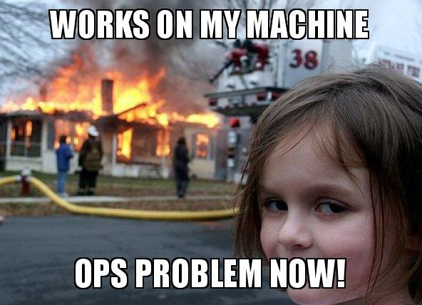

# DevOps and Continuous Integration/Deployment/Delivery

DevOps is a methodology in software development and release that aims to increase the speed
and efficiency at which software is released. This is achieved by making sure that the
developers and the operations team work together, automate away whatever possible and through
shared responsibilities.

Before we even begin to talk more about DevOps, we need to know what was there before DevOps.
What are the problems with the methods of the past

### Developers

They write code. These includes, but not limited to:
- Bug fixes 
- New features 
- Security updates 

### Operations Team

They manage the servers where the app is running.
- They make sure that the servers are up and running
- They patch the server, update the OS, manage firewall etc
- They release new code given by the developers into the servers

## Some potentially boring history

### Waterfall model - The old days

- There are different phases in this model, each dependent on the output of the previous
- Once you are past a phase, you cannot go back, like a **waterfall**
- For example, you **cannot change** the design in the implementation stage
- This meant that there had to be precise planning and the requirements has to be perfect
- A good analogy is constructing a house. You cannot change the design once you're half way with building the roof, right?

#### The problems with waterfall model

Absolutely not flexible

### The other models following waterfall

Let's just say that there were a bunch of different models that tried to fix the issues with
the waterfall model. 
For example
- Rapid Application Development
- Dynamic Systems Development Method
- Extreme Programming
But let's not concern ourselves with these

### Agile

Read the agile manifesto [here](http://agilemanifesto.org/principles.html)

The TL;DR was that, the development process should be flexible such that "good" changes are 
always welcome. If the team came up with a really great idea, even towards the end of the "development", it was to be welcomed

- Individuals and interactions over processes and tools
- Working software over comprehensive documentation
- Customer collaboration over contract negotiation
- Responding to change over following a plan 

That is, according to Scott Ambler:

- Tools and processes are important, but it is more important to have competent people working together effectively.
- Good documentation is useful in helping people to understand how the software is built and how to use it, but the main point of development is to create software, not documentation.
- A contract is important but is no substitute for working closely with customers to discover what they need.
- A project plan is important, but it must not be too rigid to accommodate changes in technology or the environment, stakeholders' priorities, and people's understanding of the problem and its solution.

## How software was released

To keep things simple and in context, let's just take two scenarios. `Pre-DevOps` and `DevOps`

> Don't quote me on it, I am just trying to explain what "DevOps" is fixing

> Imagine that there is a `git` repository with the code and the `master` 
> branch is the mainline And the developers work on their own branches 
> when making a change

### Pre-DevOps 

1. The Developer wrote the app
2. They do some tests locally
3. The changes are **NOT** merged to the master until a certain point in time. They are usually large changes
4. The integration to the main branch is done on designated time (let's say we do it once a week)
5. The developer has to make sure that their changes do not have any conflict, fix any.
6. After a lot of mental gymanstics, the code is merged
7. Now we wait until the "deploy day"
8. The operations team has to make sure that the new code will work on production. They may need to update dependencies etc
9. Finally the deploy day comes and the operations team deploys it **manually**. By running some hacked together deploy script
10. If there are issues, the Operations team has to either rollback the change
11. The operations team has to make sure that the service is healthy, add more servers if needed etc

#### The problems with this

1. Integrating large changes once a while is more error prone. Imagine a scenario where the
developer `D1` started working on a feature if done fully adds 10,000 new lines of codes.
Meanwhile, developer `D2` is working on another bug fix that changed a lot of lines.
Towards the integration of both of these to the master, it is going to be such a pain in the neck
to make sure that the changes do not break things
2. The developer's environment is different from the production, which causes:

3. Lots of errors make their way into production
4. The deployments are error prone
5. Everything is error prone because humans are unreliable

### With DevOps

Now, I am gonna talk about an ideal DevOps scenario. One can dream, right?

1. Developer writes code and ther are tests written for all the major functionalities.
Ideally, ther are tests for all the functionalities
2. Developer makes **smaller, incremental changes** and pushes to their branch
3. A "tool" runs some automated tests to make sure that the developer did not break anything
4. If the "tool" says all good, the code is merged to master.
5. This means, multiple changes are merged to the master regularly (Continuous Integration)
6. The "tool" builds the software and is ready to deploy any time (Continuous Delivery)
7. In some cases, the "tool" does not wait for any particular time, instead it deploys to production regularly (Continuous Deployment) 
8. While in production, the servers can scale themselves based on the traffic pattern, which means less headache for the "Ops"

#### What did we gain from this?

1. Considerably easier integration (due to frequent integrations)
2. We catch much more bugs before they get to production (due to automated tests)
3. If something breaks, it is easy to identify and fix because the amount of change is smaller
4. No more "deploy day headaches" for the ops team.
5. New features gets released to the customers much faster and the team can get feedback on the
changes and fix/update as needed with minimal delay

## Continuous Integration

- Developers merge their changes back to master as soon as possible. This often means several
"merge to master" per day.
- Makes use of automated tests. That is, the change is merged to the main branch only if all
the tests succeed

## Continuous Delivery

It means, we build our software as soon as it is merged and we are ready to deliver the software
at any time

## Continuous Deployment

We actually go ahead and deploy it as soon as the software is built by the tool

## So, with DevOps

### Version control

- Everything should be in `git`

### Automation

- Automated code testing (Selenium, Jenkins)
- Automated integration (Jenkins)
- Automated deployments (Jenkins
- Automate launching of infrastructure (Terraform)
- Automate the servers themselves (Ansible, Puppet, Chef)
- Whatever is possible to automate, should be automated (ideally)

### Make changes in smaller increments

- All new changes are made in small increments that are tested and integrated before continuing

### Dev environmet similar to production environment

No more `works on my machine` excuse

### Measure performance of the applications

- Metrics like response time helps us in knowing if a change made our app slower and we can look
into it to fix it (Prometheus, Grafana)
- Monitor logs (ELK)
- Thirdparty application performance monitoring tools (NewRelic, Datadog)
