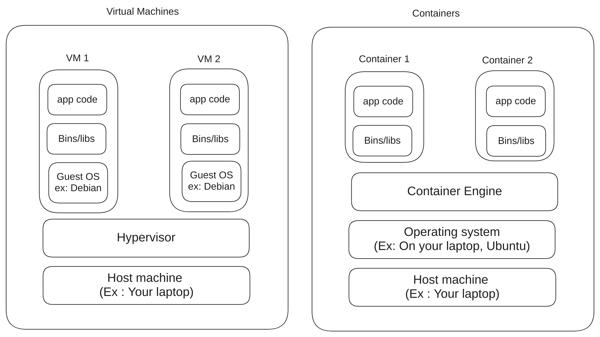

# Introduction to Containers and Containerization

## A note to beginners

> If you have never worked with Virtual Machines and if you are really new to DevOps, I strongly strongly advice you to NOT start here and instead maybe look through my video series.
> The idea is that a lot of the fundamentals that are so crucial in being a "DevOps" engineer comes from dealing with Virtual Machines

## The problem we are trying to solve

Before we even talk about what are containers and how to deal with them, we need to understand why we are doing it. If you have been following my videos, you know that we have been using Virtual Machines to setup different applications and services. It works great for what we were trying to do as well.

Then why are we talking about containers, why are they so important?

### Limitations of Virtual Machines

1. Resource overhead : Each Virtual machine needs a full operating system, it takes a lot of resources for just that.
2. Boot-up time : Virtual machines takes longer to bootup because it is a full operating system
3. Problems with inconsistencies : Unless we use images with virtual machines, it is going to be difficult to keep it consistent
4. Size and portability :  VMs mean that they need to package the whole OS, again this adds a ton of packages, libraries etc and that causes bloat. If you take a look at a disk image of any virtual machine, it will be several gigabytes in size

### What are our solutions

1. We can solve a bunch of issues using Virtual Machine images : There are tools such as [Packer](https://www.packer.io/) that will allow us to package a virtual machine image with everything we need. This does indeed solve a lot of problems in terms of dependency management, consistency etc.
2. Containers

## Containers vs Virtual Machines

#### Virtual Machines (VMs)

- **Full OS**: Each VM runs a full OS instance, including kernel and user space.
- **Resource Intensive**: Requires more resources due to multiple OS instances.
- **Size**: Disk images are often several gigabytes.
- **Boot-up Time**: Slower, as it involves booting up an entire OS.
- **Isolation**: Complete isolation, as each VM is separated at the hypervisor level.
- **Management**: Managed by hypervisors (e.g., VMware, Hyper-V).

#### Containers

- **Shared OS**: All containers share the **host OS kernel** but have isolated user spaces.
- **Lightweight**: Requires fewer resources, as only the application and its dependencies are packaged.
- **Size**: Containers can be just tens of MBs in size (or even smaller).
- **Boot-up Time**: Near-instantaneous start-up.
- **Isolation**: Process-level isolation using namespaces and cgroups.
- **Management**: Managed by container runtimes (e.g., Docker, containerd).

