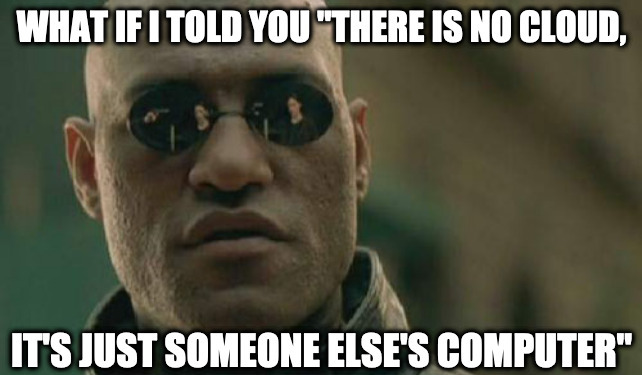

# Google Cloud #1 - What is Cloud

Video : [HERE](https://www.youtube.com/watch?v=YDA6DBWxOMc)

What is cloud? The term `cloud` is mostly used as a marketing term. It simply means servers and services rented
from a provider.

Providers like Amazon (AWS) and Google (GCP) have huge datacenters across the globe with ton of servers in each.

These servers are powerful computers with really fast internet connection. Now, people like you and me can pay these
companies a fair amount to use these computers and do our own stuff with it

You want to run your website, video game server, application etc, we can use them.

## So how do these companies do it?

It's not magic

They have big datacenters with powerful physical servers. Now they can use virtualization and create tons of virtual machines
on these physical servers. Think back to how we used virtual machines to do our stuff in the previous videos.

Now these VMs can be purchased by us and are billed by hour (usually)

If you want to run your small website, that only needs 1cpu and 1GB, you can buy a small VM from Google cloud. And you only pay for that.
When in future your website grows and needs more resources, you can make your VM bigger by the click of a button. That is why cloud is powerful. We only need to pay for what we use and we can use ony what we need

## When to use cloud?

If you want to host something on the internet, you have lots of choices on how you can do that.
If the content is static, it's pretty straight forward, and there are a lot of free options out there.
You can use Github Pages for example to host your static site for free.

But if it is a dynamic website, it is difficult to find a good free option. If your needs are pretty minimal, you can
go for a webhost where they put your website on a shared server with other people, which can be slow and insecure.

Another option you have is to buy a VPS (a virtual machine from a provider - nowadays there are no difference between a VPS
and a cloud provider's VM)

Another option you have is to build your own datacenter. Depending on who you are and what you are trying to do, it could be one 
reasonable option. But for most people, a cloud provider is the better option

## Which cloud provider should I use?

If You are a developer, really small business etc, it is usually cheaper and better to go with a provider like Digital Ocean
that offer cheaper services and are fairly easy to get started.

But if you are a bigger business and needs room for growth and complex infra, then definitely go with a bigger player like
AWS, Google Cloud, Azure etc

I personally prefer Google Cloud because how well put the service is in comparison to AWS.

## Why use cloud

- Pay as you go (You pay for the CPU, memory, bandwidth instead of number of servers)
- Can scale up/down to meet our needs (Adding more/less servers)
- Can create complex infrastructure
- Easier to manage than a datacenter
