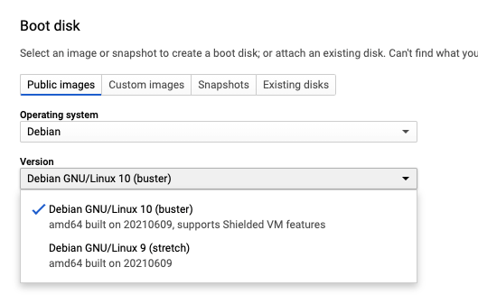

# Google Cloud #5 - Disk snapshots and images

## What is a snapshot

Our VMs have disks. By default we only have the boot disk. We can take a point in time snapshot of a disk and save it. 

### What can we do with a snapshot?

- Use it as a backup of our data. We can restore it any time
- We can create a new instance using a snapshot

### Creating Snapshot

1. Go [HERE](https://console.cloud.google.com/compute/snapshotsAdd) 
2. Give a name
3. Select souce disk
4. Select storage location
5. Create

## Images

The default disk on a VM where the operating system is installed is called the "boot disk". We can use images to create
boot disks.

### Types of disk images

1. Public images: These are provided by Google, open source community etc. Example would be the debian disk image we
used

2. Custom images : These are our own images, created by us for our specific use cases.

### What is the use of custom images?

If we have created an image with all the packages and configurations we need for our application to run, then we can
re-use this image to quickly launch new servers. This is mostly needed when we have autoscaling setup (coming up soon).
This behaves similar to docker images.

For example, if we have a VM with nginx, mysql etc installed and if we create an image from this disk, then when we
create a new VM with this custom image, it will have all these packages installed

### Creating a custom disk image

GCP documentation is a lot nicer for this. Check it out [HERE](https://cloud.google.com/compute/docs/images/create-delete-deprecate-private-images)