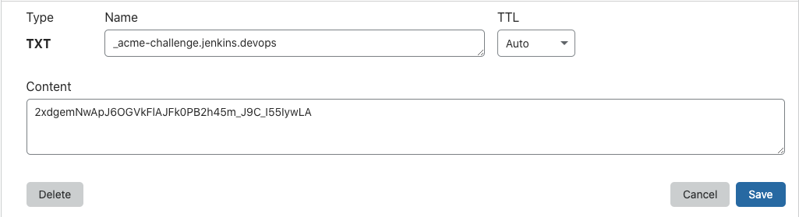

# How to setup SSL certificates locally using Let's Encrypt

If you want to setup actual trusted SSL certificates locally, you can do that
using Let's Encrypt

## But why?

If you have a local development environment, then it makes sense to do it like this.
Of course, you can have self signed certificates but that would involve trusting the
CA in your browsers as such.


## Requirement

You need a publicly registered domain name that you can add TXT records to


I have a Debian 10 virtualmachine running at 192.168.33.14. I have a domain
pointed to it. The domain in this case is `jenkins.devops.esc.sh`

## The setup

### Step 1 - Install Certbot

Assuming you are using a Debian virtual machine

```
sudo apt install certbot python4-certbot-nginx
```

### Step 2 - Fetch certificate using DNS challenge

```
certbot -d your-domain.com --manual --preferred-challenges dns-01 certonly
```

this will put you in a prompt like below
Press Y for the question of logging the IP address.

```
root@jenkins-server:~# certbot -d jenkins.devops.esc.sh --manual --preferred-challenges dns-01 certonly
Saving debug log to /var/log/letsencrypt/letsencrypt.log
Plugins selected: Authenticator manual, Installer None
Obtaining a new certificate
Performing the following challenges:
dns-01 challenge for jenkins.devops.esc.sh

- - - - - - - - - - - - - - - - - - - - - - - - - - - - - - - - - - - - - - - -
NOTE: The IP of this machine will be publicly logged as having requested this
certificate. If you're running certbot in manual mode on a machine that is not
your server, please ensure you're okay with that.

Are you OK with your IP being logged?
- - - - - - - - - - - - - - - - - - - - - - - - - - - - - - - - - - - - - - - -
(Y)es/(N)o: Y

- - - - - - - - - - - - - - - - - - - - - - - - - - - - - - - - - - - - - - - -
Please deploy a DNS TXT record under the name
_acme-challenge.jenkins.devops.esc.sh with the following value:

2xdgemNwApJ6OGVkFlAJFk0PB2h45m_J9C_I55IywLA

Before continuing, verify the record is deployed.
- - - - - - - - - - - - - - - - - - - - - - - - - - - - - - - - - - - - - - - -
```

Copy the TXT record and add it in your domain's DNS. I am using Cloudflare for DNS
so I have added it like this



And in `dig` it should show up like this

```
➜  ~ dig _acme-challenge.jenkins.devops.esc.sh TXT +short
"2xdgemNwApJ6OGVkFlAJFk0PB2h45m_J9C_I55IywLA"
➜  ~
```

**After verifying that the TXT record is propagated** press `Enter` and certbot should
fetch a fresh certificate and place it under `/etc/letsencrypt/live/<your domain>/`.
You can use it anywhere

For example, you can configure Nginx to use it like this
To create letsencrypt.conf, refer [THIS](setting-up-letsencrypt-ssl-with-nginx.md#step-3---create-letsencryptconf)

```nginx
server {
    listen 80;

    include /etc/nginx/snippets/letsencrypt.conf;

    server_name your-domain-name.tld;

    root /var/www/your-domain-name.tld;
    index index.html;

    listen 443 ssl; 
    ssl_certificate /etc/letsencrypt/live/your-domain-name.tld/fullchain.pem; 
    ssl_certificate_key /etc/letsencrypt/live/your-domain-name.tld/privkey.pem; 
    include /etc/letsencrypt/options-ssl-nginx.conf; 
    ssl_dhparam /etc/letsencrypt/ssl-dhparams.pem; 
}
```

## More Configuration options (like http -> https redirection)

If you would like to know how to do more configuration options such as redirecting
http to https or redirecting www to non-www etc, refer to this doc

[Setting up Let's Encrypt](setting-up-letsencrypt-ssl-with-nginx.md)
